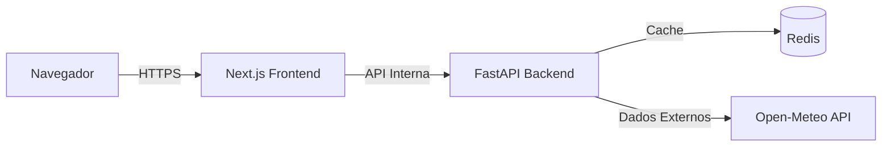

# Clima para Manejo

Plataforma de inteligência climática para o agronegócio, focada no manejo operacional da cana-de-açúcar. Oferece visualização em tempo real de indicadores críticos como saldo hídrico (P - ET₀), janelas de pulverização e colheita, com suporte a decisão offline-first e baixa latência.

---

## 🎯 Visão Geral

O **Clima para Manejo** resolve a lacuna entre dados meteorológicos brutos e a tomada de decisão no campo. Em vez de apenas mostrar a temperatura, processamos variáveis complexas para entregar *insights* acionáveis:

*   **Saldo Hídrico Diário:** Cálculo automático de Precipitação vs. Evapotranspiração de Referência (FAO-56).
*   **Janela Operacional:** Indicadores claros (Verde/Vermelho) para condições de pulverização e tráfego de máquinas.
*   **Dados Hiperlocais:** Busca precisa por geocodificação global.

## 🛠️ Stack Tecnológica

Construído com uma arquitetura moderna, escalável e tipada de ponta a ponta.

### Frontend
*   **Next.js 14 (App Router):** Server-Side Rendering (SSR) e otimização de performance.
*   **TypeScript:** Segurança de tipos estrita.
*   **Tailwind CSS + shadcn/ui:** Design system responsivo e acessível (temas Claro/Escuro).
*   **State Machine:** Gestão robusta de estados de UI (loading, erro, sucesso).

### Backend
*   **FastAPI (Python):** Alta performance assíncrona.
*   **Redis:** Cache distribuído para redução de latência e proteção de rate limit.
*   **Pydantic:** Validação de dados rigorosa.
*   **Arquitetura Limpa:** Separação clara de responsabilidades (Rotas, Serviços, Schemas).

### DevOps & Qualidade
*   **Docker Compose:** Ambiente de desenvolvimento e produção containerizado.
*   **CI/CD (GitHub Actions):** Pipelines automatizados de teste, lint e segurança.
*   **Testes:** Pytest (Backend) e Jest/Testing Library (Frontend).
*   **Segurança:** Rate Limiting, Headers HTTP seguros, Scan de vulnerabilidades (Trivy).

## 🚀 Como Rodar

A aplicação é totalmente containerizada. Você precisa apenas do **Docker** e **Docker Compose**.

```bash
# 1. Clone o repositório
git clone https://github.com/samdevtx/clima-manejo.git
cd clima-manejo

# 2. Inicie a aplicação
docker compose up --build
```

Acesse em seu navegador:
*   **Frontend:** [http://localhost:3000](http://localhost:3000)
*   **API Docs:** [http://localhost:8000/docs](http://localhost:8000/docs)

## 🏗️ Arquitetura

O sistema adota o padrão **BFF (Backend for Frontend)** simplificado, onde o Next.js atua como camada de apresentação e proxy reverso para o FastAPI, garantindo segurança (Same-Origin) e simplificando o consumo de APIs.



### 📂 Estrutura do Projeto

```bash
clima-manejo/
├── backend/                # API FastAPI
│   ├── app/
│   │   ├── routes/         # Endpoints (Weather, Cities)
│   │   ├── services/       # Regras de Negócio (OpenMeteo, Cache)
│   │   └── schemas/        # Pydantic Models (Contratos)
│   └── tests/              # Testes de Integração
├── frontend/               # Next.js App
│   ├── src/
│   │   ├── app/            # App Router (Páginas)
│   │   ├── components/     # UI Components (Atomic Design)
│   │   └── lib/            # Utilities (API Client, Formatters)
└── docker-compose.yml      # Orquestração
```

### Decisões Técnicas Chave
1.  **Cache Estratégico:** O Backend implementa cache Redis (TTL 10min) para chamadas externas, reduzindo custos e latência.
2.  **Resiliência:** O Frontend possui *Error Boundaries* e *Skeletons* para garantir UX fluida mesmo em falhas parciais.
3.  **Normalização:** Todos os dados são normalizados no Backend, entregando ao Frontend apenas o necessário para renderização (padrão *View Model*).

## 🔌 API Reference

### `GET /cities?q={termo}`
Busca cidades por nome. Retorna lista normalizada com coordenadas.

### `GET /weather?city={nome}&lat={lat}&lon={lon}`
Retorna o relatório climático consolidado.
*   **current:** Condições atuais (Temp, Vento, Umidade).
*   **derived:** Indicadores calculados (Saldo Hídrico, Janela Operacional).
*   **today:** Resumo do dia (Máx/Mín, Precipitação total).

---
*Desenvolvido com foco em performance, manutenibilidade e experiência do usuário.*
